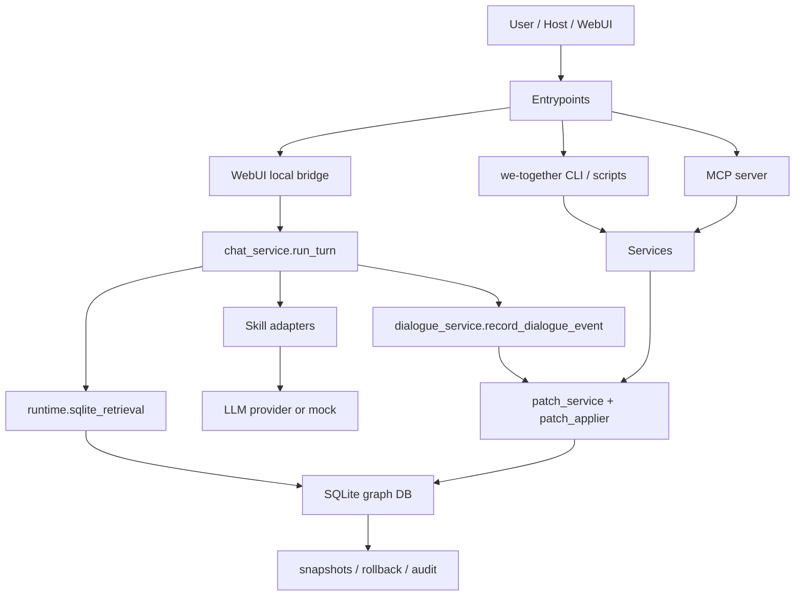
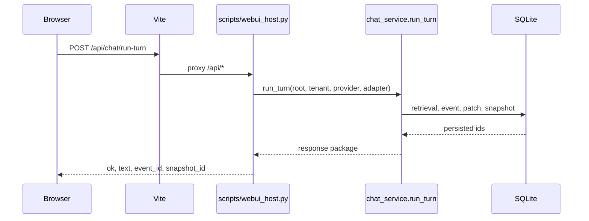

# 架构总览

## 设计原则

we-together 的架构围绕四条硬约束展开：

1. **Skill-first**：核心运行时不绑定某个宿主。Claude、OpenAI、MCP、Codex、WebUI 都只是入口。
2. **Event-first**：任何演化先写 event，再推理 patch，再改图谱。
3. **Patch-only graph writes**：结构性变更必须经过 patch / service 层，避免绕过审计链。
4. **Local-first**：默认数据和 provider key 留在本地 CLI/runtime 环境，浏览器不默认持有 token。

## 当前分层



## 核心模块

| 层 | 代表文件 | 责任 |
|---|---|---|
| CLI | `src/we_together/cli.py`, `scripts/*.py` | 统一命令入口和高频运维脚本 |
| Runtime | `src/we_together/runtime/skill_runtime.py` | 平台无关的 SkillRequest / SkillResponse schema |
| Retrieval | `src/we_together/runtime/sqlite_retrieval.py` | 从 SQLite 构建 scene-grounded retrieval package |
| 对话 | `src/we_together/services/chat_service.py` | 串联 retrieval、adapter、LLM/mock、event、patch、snapshot |
| 演化 | `patch_service`, `patch_applier`, `snapshot_service` | 图谱写入、审计、回滚 |
| 导入 | `ingestion_service`, `import_*` scripts | 统一 evidence / candidate / patch 导入链 |
| 图谱维护 | drift / decay / forgetting / merge / unmerge / tick | 长期演化和修复 |
| 世界建模 | `world_service`, `agent_drives`, `dream_cycle` | Object / Place / Project / Agent 自主 |
| 宿主 | Claude/OpenAI/MCP/Codex/WebUI | 把同一套 runtime 暴露给不同使用环境 |

## 数据模型

核心对象：

- `Person`
- `IdentityLink`
- `Relation`
- `Group`
- `Scene`
- `Event`
- `Memory`
- `State`
- `Patch`
- `Snapshot`
- `LocalBranch`

世界模型扩展：

- `Object`
- `Place`
- `Project`
- `agent_drives`
- `autonomous_actions`

存储路径：

```text
default tenant:
  <root>/db/main.sqlite3

named tenant:
  <root>/tenants/<tenant_id>/db/main.sqlite3
```

`tenant_id` 由 `tenant_router.normalize_tenant_id()` 校验，只接受安全的短标识。

## 对话运行链

`chat_service.run_turn()` 是当前对话主入口：

```text
scene_id + user_input
  -> build_runtime_retrieval_package_from_db()
  -> build_skill_request()
  -> adapter.invoke()
  -> llm_client.chat()
  -> record_dialogue_event()
  -> infer_dialogue_patches()
  -> apply_patch_record()
  -> event_id + snapshot_id + applied_patch_count
```

这条链路的重要含义是：即使入口来自 WebUI，本地 bridge 也不直接改图谱，而是把写入交回 `chat_service.run_turn()`。

## WebUI local bridge

WebUI 的默认模式是本地 skill runtime：



默认情况下：

- `GET /api/runtime/status` 返回 `mode=local_skill` 和 `token_required=false`
- `GET /api/scenes` 从本地 tenant DB 读 active scenes
- `GET /api/summary` 从本地 tenant DB 读 summary counts
- `GET /api/graph` 从本地 tenant DB 读 person / relation / memory / group / scene / state / object / place / project 节点和连接边
- `GET /api/events`、`/api/patches`、`/api/snapshots` 读取最近运行留痕
- `GET /api/branches?status=open` 读取 operator review 队列和候选
- `GET /api/world` 读取 Object / Place / Project / agent_drives / autonomous_actions 运行态
- `POST /api/bootstrap`、`/api/seed-demo`、`/api/import/narration` 让空 runtime 可以从 WebUI 初始化和导入材料
- `POST /api/branches/<branch_id>/resolve` 通过 `resolve_local_branch` patch 关闭本地复核分支，operator note 会写入 resolve `reason`
- `POST /api/chat/run-turn` 调用 `chat_service.run_turn()`

浏览器 token 只保留为高级远程 API 模式。

## 不变式与 ADR

当前不变式注册表有 28 条，且 28 条都有测试引用。对架构最关键的是：

- #1 事件优先
- #5 Skill-first 通用型
- #12 snapshot 可回滚
- #18 主动写入经预算和偏好门控
- #19 SkillRuntime schema 版本化
- #22 写入对称撤销
- #23 扩展点必须通过 plugin registry
- #25 跨图谱出口必须 PII mask + visibility 过滤
- #27 Agent 自主行为必须可解释
- #28 派生字段必须可重建

进一步阅读：

- [当前状态](../superpowers/state/current-status.md)
- [不变式覆盖](../superpowers/state/2026-04-19-invariants-coverage.md)
- [v0.19 synthesis ADR](../superpowers/decisions/0073-phase-65-70-synthesis.md)
