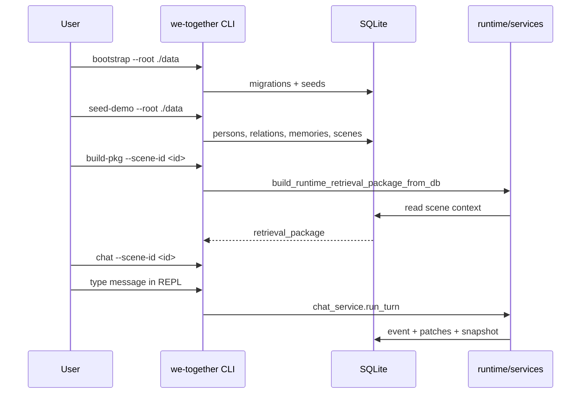
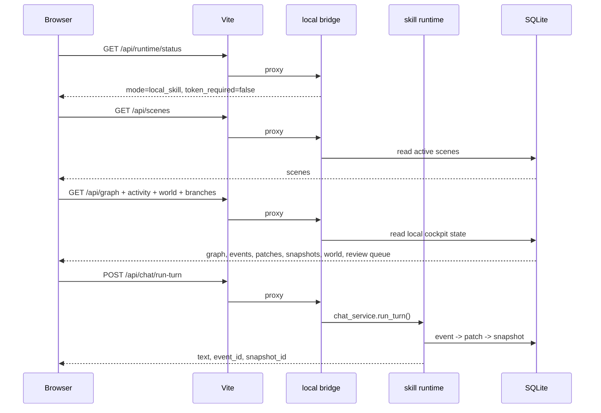
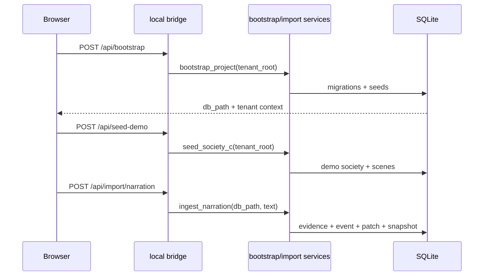

# 交互流程

## CLI 最小闭环



适用场景：

- 快速验证图谱是否健康。
- 做端到端 smoke。
- 在无浏览器环境跑一轮对话和写入。

如果回复来自外部系统，可用 `dialogue-turn --user-input ... --response-text ...` 直接记录这一轮已知对话。

## WebUI 默认流程



关键点：

- WebUI 是本地 skill 的界面，不是独立 SaaS token 客户端。
- 默认 provider 从 CLI 环境继承，通常是 `mock`。
- WebUI token 输入框只用于高级远程 API 模式。
- 没有 scene 时，WebUI 应提示初始化，而不是发送静态 demo scene。
- 默认生产路径不静默注入 demo 数据；demo 只在 `?demo=1` 或 `localStorage.we_together_demo_mode=1` 时启用。
- graph cockpit 覆盖 person / relation / memory / group / scene / state / object / place / project；world cockpit 覆盖 objects / places / projects / agent_drives / autonomous_actions。

## WebUI 初始化 / 导入流程



这三个动作都是本地 operator action。浏览器只发请求，不接管 provider token，也不直接写 SQLite。

## Codex / MCP 交互流程

```text
用户中文请求
  -> Codex skill router
  -> 选择 we-together-dev/runtime/ingest/world/simulation/release
  -> 读取 local-runtime.md
  -> 使用 repo_root 和 MCP server
  -> 调用本地工具或读取代码/文档
  -> 返回中文结果或继续工程任务
```

适用请求：

- `we-together 当前状态`
- `we-together 不变式`
- `we-together 图谱摘要`
- `we-together 导入材料`
- `we-together tenant/world 状态`
- `we-together release 自检`

## 导入材料流程

```mermaid
flowchart LR
  source["Text / chat / email / file / directory"] --> importer["Importer"]
  importer --> evidence["raw_evidence"]
  importer --> candidates["candidate layer"]
  candidates --> fusion["fusion / branch decision"]
  fusion --> patches["patch records"]
  patches --> graph["graph state"]
  graph --> retrieval["retrieval package"]
```

原则：

- importer 不应该随意直接改业务图谱。
- 低置信或冲突材料应进入 candidate / local_branch。
- 可逆、可审计优先于一次性“聪明写入”。

## Operator review 流程

```text
contradiction or merge suspicion
  -> derive candidates
  -> open local_branch
  -> operator sees keep_merged / unmerge_person
  -> WebUI POST /api/branches/<branch_id>/resolve with optional operator note
  -> selected candidate resolves branch
  -> note is stored as resolve reason
  -> effect patches apply through patch_applier
  -> branch closed or remains open on failure
```

这个流程对应当前 WebUI review queue 的产品方向：人类负责高风险选择，系统负责留痕、候选解释和可逆写入。

## Daily maintenance / tick 流程

```text
daily-maint or simulate_week
  -> relation drift
  -> state decay
  -> branch auto resolve where safe
  -> merge duplicates where safe
  -> persona drift / memory condensation
  -> snapshot / metrics / sanity
```

带 `--skip-llm` 可以跳过真实 LLM 步骤，用于低成本维护和测试。

## 多租户流程

```text
request root + tenant_id
  -> normalize_tenant_id()
  -> resolve_tenant_root()
  -> resolve db path
  -> run same services against tenant DB
```

默认 tenant 是向后兼容路径：

```text
<root>/db/main.sqlite3
```

命名 tenant：

```text
<root>/tenants/<tenant_id>/db/main.sqlite3
```

多租户只改变数据 root，不改变 runtime 语义。
